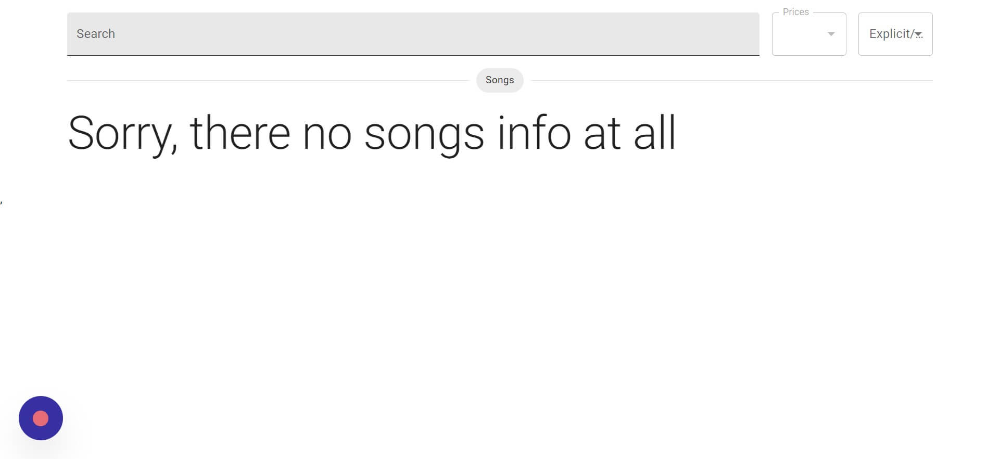
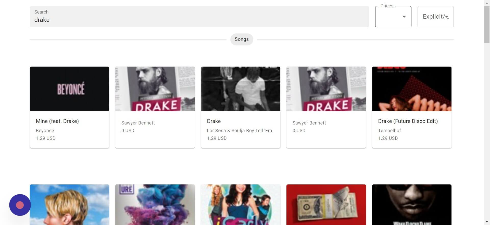
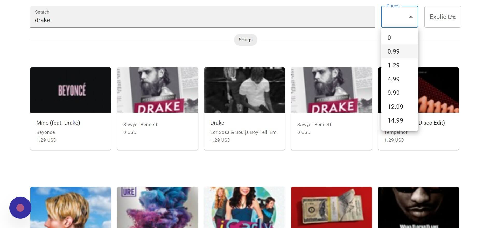
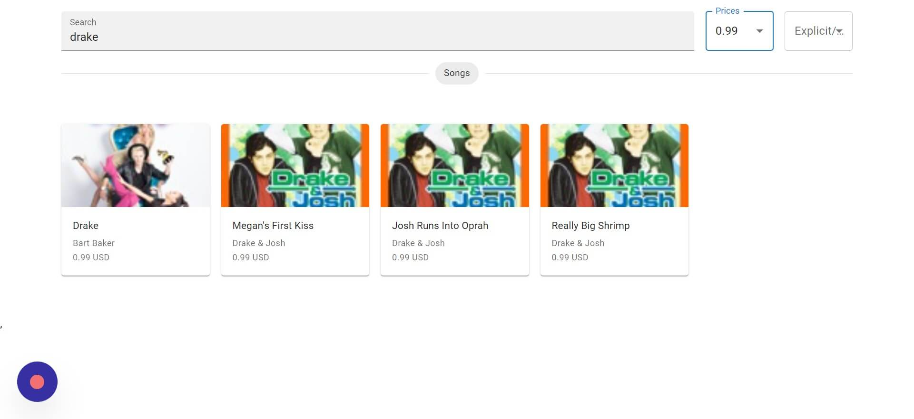
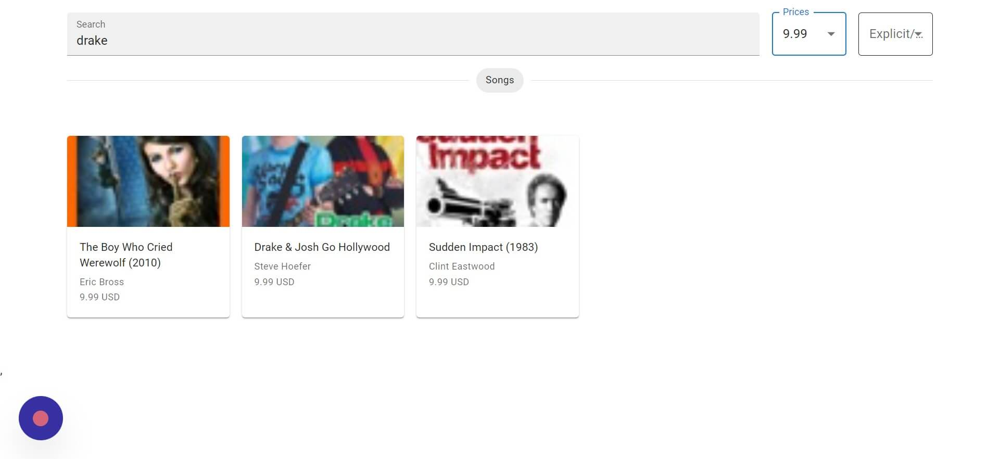
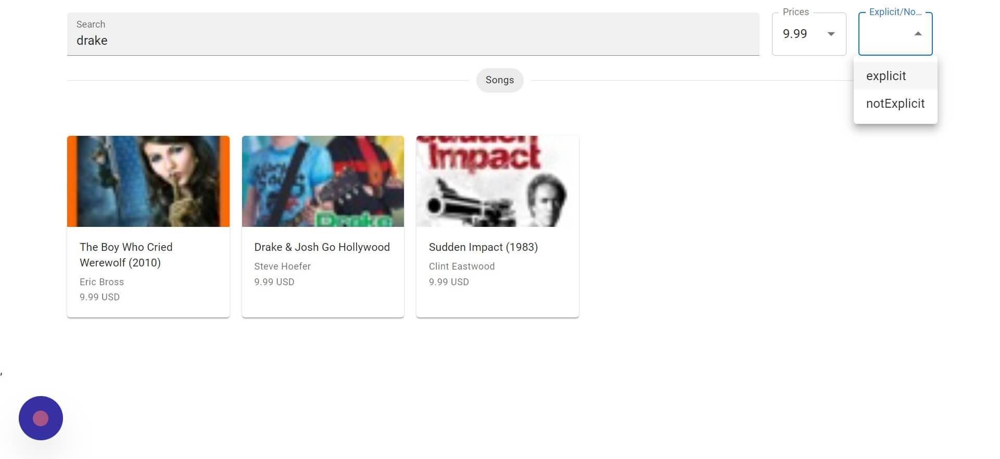
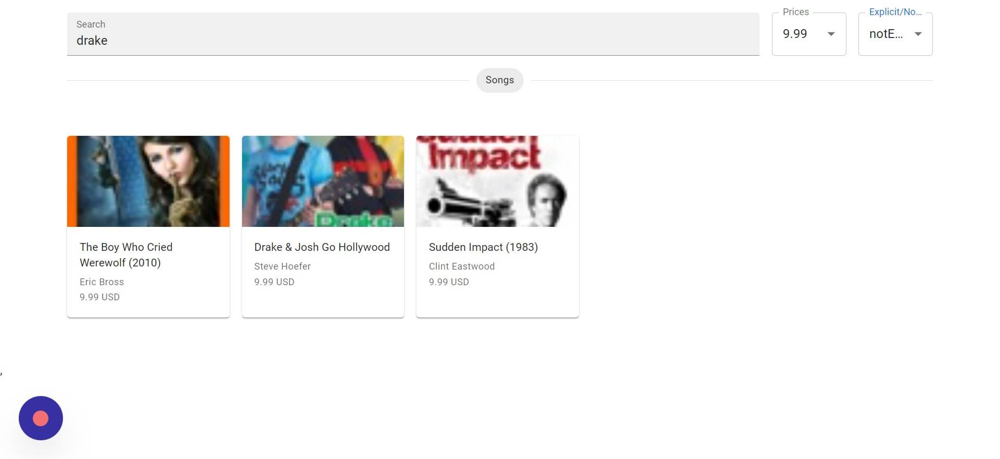

# Kamereo Coding Assignment

## Overview

This is a solution to the [Finding Song Info using the Itunes API]

## Key Features:

The following are the features of the music search functionality:

- You can search for song information or artist-related search terms by typing them into the search input box.
- Itunes will return the relevant data as a carousel of info cards that contain images, track titles, track prices, and other details.
  You can easily filter the data based on specific categories such as prices and track explicitness by selecting the appropriate options.

## Installation

Clone this repo and install all dependencies

```
git clone https://github.com/Antonio0402/react-itunes.git

cd react-itunes

npm install

npm run dev
```

## Commands

All commands are run from both client and server of the project, from a terminal:

| Command             | Action                                              |
| :------------------ | :-------------------------------------------------- |
| `npm install`       | Installs dependencies                               |
| `npm run dev`       | Starts local dev server at `localhost:port`         |
| `npm run build`     | Build your production site on destination dir       |
| `npm run preview`   | Preview your client build locally, before deploying |


### Screenshot

#### Navigate to http://localhost:5173/

#### Click on the search field



#### Typing the search term you want to search for

#### The search results


#### Click on the Price Filter Selection Box



#### Choosing the price you want filter.jpeg



#### The result after applying filter



#### Click on the Expliciteness Filter Selection Box



#### Choosing the expliciteness or not explicitness attribute



#### The result after applying expliciteness filter


